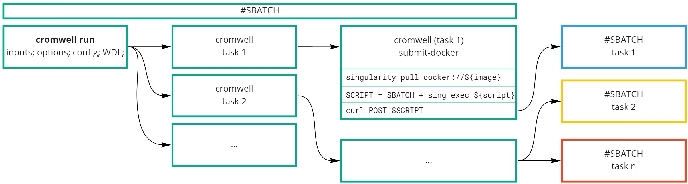

# Cromwell + SLURM na cyfronecie

Dokument opisuje, w jaki sposób uruchomić w infrastrukturze PLGrid dowolny workflow, wykorzystując SLURM jako _backend_ i Singularity jako narzędzie _konteneryzacji_.

## Jak działa rozwiązanie

Ogólny schemat został pokazany na rysunku poniżej.



W zadaniu batchowym uruchamiany jest Cromwell wraz ze zdefiniowanymi danymi wejściowymi _inputs.json_, opcjami _options.json_, konfiguracją _config.conf_ oraz oczywiście _workflowem_. Cromwell za pomocą API (usługa Rimrock) zleca następnie kolejne etapy obliczeń jako osobne zadania batchowe.

### Opis plików:

- `inputs.json`, `options.json`, `*.wdl` - standardowe, niemodyfikowane pliki workflowu
- `run-workflow.slurm.sh` - skrypt ułatwiający uruchamianie zadania. Zawiera on opcje dla komendy `sbatch`, ładuje potrzebne moduły i wykonuje `cromwell run` wewnątrz `sg`, aby ustawić domyślną grupę. Można w nim wskazać katalog, do którego będą zapisywane logi cromwella.
- `config.conf` - konfiguracja backendu SLURMowego. Zawiera ona dwie definicje: `submit` i `submit-docker` (dla zadań, które w bloku `runtime` mają zdefiniowany obraz dockerowy). Jedyna konieczna zmiana w tym pliku to dostosowanie partycji i limitu czasu zbiorczo dla wszystkich zadań oraz ustawienie katalogu, gdzie będą zapisywane logi.

### Uruchomienie przykładowego workflowu

1. Upewnić się, że `SINGULARITY_CACHEDIR` jest dobrze ustawione oraz że zmienna środowiskowa `$proxy` zwraca certyfikat.
1. W pliku `config.conf` (i ewentualnie `run-workflow.slurm.sh`) zdefiniować katalog z logami.
1. Uruchomić komendę: `sbatch run-workflow.slurm.sh` w katalogu `slurmwell`.
1. Wynikiem będzie plik `out/all_numbers` zawierający 4 losowe liczby.

## Warunki wstępne

1. Singularity Cache Dir

   Dobrze jest mieć ustawioną zmienną śodowiskową `SINGULARITY_CACHEDIR`, tak aby pobierane obrazy nie były zapisywane w katalogu domowym, który ma ograniczone miejsce. Można posiadać w swoim `.bash_profile` następującą konfigurację: 
   ```bash
   export SINGULARITY_CACHEDIR=$SCRATCH/singularity-cache
   ```
   W przypadku, gdy pierwszy raz używamy danego obrazu, jest on pobierany, budowany i zapisywany w cache'u. Ten proces może trwać nawet kilka godzin, ale jest jednorazowy (aż do użycia nowszego obrazu lub wyczyszczenia cache'a). Podczas tworzenia obrazu dostęp do cache'a jest blokowany, tak aby nie tworzyły się konflikty. Na przykład w przypadku funkcji `scatter`, tylko jedno zadanie spowoduje pobranie obrazu, a pozostałe będą czekać na uruchomienie. Wtedy ich późniejszy start będzie bardzo szybki, gdyż będą korzystać już z gotowego kontenera. Obraz Singularity jest budowany przez główne zadanie batchowe, w którym działa Cromwell. Ze względu na limity zapytań do _docker hub_ komenda `singulairty exec` zawiera ścieżkę do zapisanego pliku obrazu, a nie łącze `docker://`.

1. Certyfikat proxy (instrukcja może ulec zmianie)

   Aby zlecać zadania poprzez API, należy wcześniej mieć uruchomioną odpowiednią usługę oraz aktywny certyfikat do uwierzytelniania. Robi się to w następujący sposób:
   - Zalogować się na [Portalu PLGrid](https://portal.plgrid.pl/) i w zakładce Certyfikaty wygenerować _Simple CA_ (jeżeli nie był wcześniej wygenerowany). Jest on ważny przez rok.
   - Zapisać certyfikat na dysku i przesłać go na serwer. Najwygodniej jest to zrobić do domyślnej lokalizacji (`~/.globus/usercred.p12` - uwaga na zmienioną nazwę pliku oraz katalog, który może jeszcze nie istnieć). Dodatkowo należy zmienić uprawnienia dla pliku na `600`.
   - Wygenerować _proxy certificate_ za pomocą komendy `grid-proxy-init -valid 8760:0`. Będzie on wtedy ważny przez rok (jest to inny certyfikat niż ten wygenerowany na Portalu). Wymagane będzie podanie hasło do logowania na serwerze.
   - Utworzyć i wyeksportować zmienną środowiskową `proxy` za pomocą komendy `export proxy=$(base64 -w 0 $(grid-proxy-info -path))`. Ten krok należy robić po każdym logowaniu (istnieje lepszy i bezpieczniejszy sposób?)

1. Usługa Rimrock

   Po zalogowaniu się do [Katalogu aplikacji i usług](https://aplikacje.plgrid.pl) należy wyszukać usługę _Rimrock_ i ją aktywować. Powyższą konfigurację można zweryfikować uruchamiając komendę:
   ```bash
   curl -k -X POST \
       --data '{"host":"pro.cyfronet.pl","script":"#!/bin/bash\n#SBATCH -p plgrid-testing\ndate"}' \
       --header "Content-Type:application/json" \
       --header "PROXY:$proxy" https://rimrock.plgrid.pl/api/jobs
   ```
   Spodziewany wynik to:
   ```json
   {"job_id":"dddddddd.login01.prometheus.cyfronet.pl","stdout_path":"https://data.plgrid.pl/download/path/out","stderr_path":"https://data.plgrid.pl/download/path/err","status":"QUEUED"}
   ```

## Rozwiązywanie problemów

1. Błąd _"Unable to create new directory"_ po wysłaniu żądania zlecenia zadania przez REST API. Prawdopodobny powód to "błąd replikacji danych do ldap" i należy zgłosić się do helpdesku.
1. Błąd _Disk quota exceeded_ najprawdopodobniej spowodowany jest próbą zapisu w katalogu grupowym z domyślną grupą _plgrid_. Aby rozwiązać ten problem, można uruchomić nową podpowłokę ze zmienioną domyślną grupą (`newgrp <nazwa_grupy>`) lub uruchomić polecenie w nowej, zmodyfikowanej podpowłoce (`sg <nazwa_grupy> -c 'komendy'`).
1. Logi z zadań batchowych domyślnie zapisywane są w katalogu grupowym w folderze `slurm-log`. Znajdują się w nim logi zwracane przez Cromwella (główne zadanie) oraz te zwracane przez kolejne uruchomione zadania. Dla ułatwienia napisałem skrypt `tail-job <job_id>`, który wyświetla zawartość logów z podanego zadania (domyślnie jest to ostatnio zmodyfikowany plik). Drugim miejscem, gdzie można szukać informacji o błędach są logi Cromwella w katalogach `execution/`. Niestety nie wszystkie błędy zapisują się w logach. Przykładowo, gdy Cromwell nie będzie w stanie zlecić zadania, błędy w blokach `submit` i `submit-docker` nie będą nigdzie widoczne. W folderze `slurm-log` zapisywane są również skrypty, które zostały przesłane przez API.
1. Plik konfiguracyjny (`config.conf`) zawiera opcję `run-in-background = true`. Oznacza ona, że Cromwell nie dostaje żadnego linku (np. w postaci ID) do uruchomionego zadania. W pewnych odstępach czasu sprawdza on tylko czy w katalogu zadania znajduje się plik `rc` z kodem powrotu i na tej podstawie ocenia, czy zadanie się wykonało (z sukcesem lub bez). Powoduje to, że gdyby jakieś zadanie zostało nagle przerwane, to nie zdąży ono zwrócić żadnego kodu i Cromwell będzie czekał w nieskończoność na jego zakończenie.

## Do zrobienia
1. Skonfigurowanie bazy danych dla Cromwella, aby mógłby on być powtórnie uruchamiany i "pamiętał" wykonane zadania. Obecnie baza danych jest w pamięci i znika, gdy Cromwell zostaje zamknięty.
3. Usunięcie opcji `run-in-background = true`, tak aby Cromwell mógł zamykać i kontrolować wykonywanie (_check-alive_) zleconych zadań.
